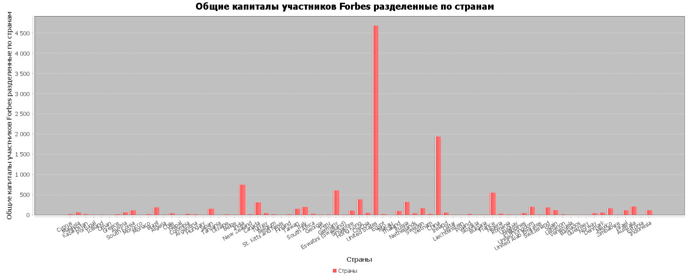
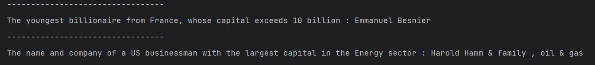

## Отчет по практике 

Программа предназначена для обработки файла формата csv, 
преобразовывает их в объекты java, записывает объекты в субд Sqlite, 
и далее читая данные из бд выполняются задания согласно варианту.

### Пошаговый ход программы
1. Заходим в метод main(от сюда и начинается выполнение программы).
2. Util.createTable(), создает таблицы в базе данных необходимых для хранения данных.
3. Util.populatingDatabase(), под капотом парсит файл csv, делает объекты java, далее конвертирует в другие объекты с помощью класса Converting и заполняет таблицы этими данными.
4. ReadDatabaseService это сервис который предназначен для работы с данными базы данных, с помощью этого сервиса мы читаем данные и отдаем их методу main() для вывода в консоль и построения графика.

